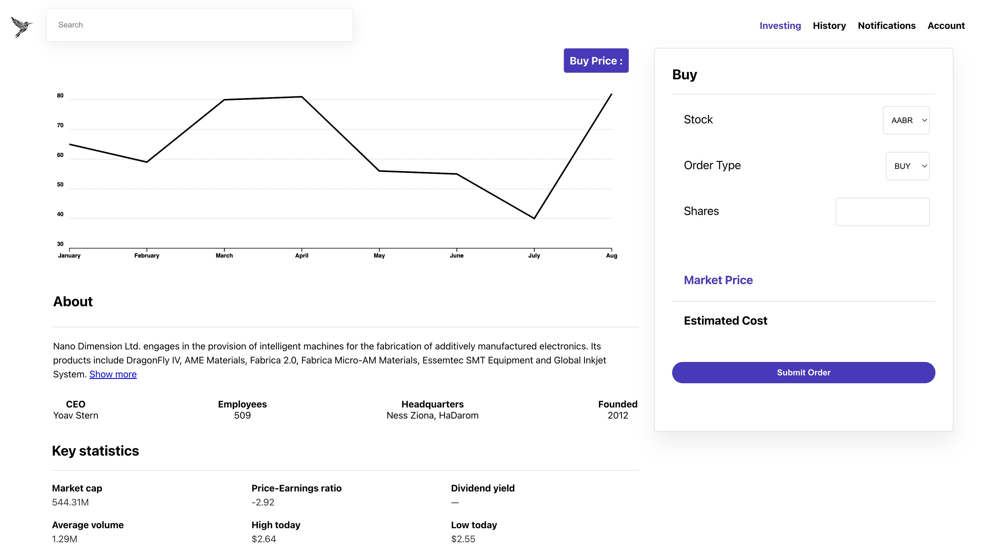

# Multi-Region CRDB Supported Trading App 

This demo showcases a trading application leveraging CockroachDB's multi-region capabilities to ensure high availability and low latency. The application comprises a frontend React app, a backend Node.js service, and multiple CockroachDB instances across different regions. It also includes Python scripts for generating trading workloads.

### Features
- Frontend: Built with React.js, providing a responsive UI for trading activities.
- Backend: Node.js service handling API requests and connecting to CockroachDB.
- Multi-Region Database: CockroachDB instances deployed in US West, US East, and EU West regions, demonstrating multi-region support and fault tolerance.
- Python Workloads: Scripts to simulate trading account creation, order processing, and trade execution.



### Requirements
- Docker
- Docker Compose
- Colima for Mac users

# Setup 
- Clone the Repository: git clone <repo-url>
- Start Services: Use Docker Compose to start the services.
```
docker-compose up -d
```
- Initialize Database: Run the initialization script ```docker-compose up crdb-init```
-  ### To Setup the infrastructure run `docker-compose up`

   Infrastructure that will be created
   - 9 node cockroachDB Cluster across 3 regions -> us-west-2,us-east-1,eu-west-1
   - 3 HAProxy load balancers per region
   - Frontend - Trading/Order Processing App React App
   - Backend - node app 

   P.S -  You will see errors for trade-account-generator and trade-order-generator service, these fail because CRDB will be getting setup. We will set it up in just a bit.

- ### Verify CockroachDB is initialized 

  Check CockroachDB is running by going to `http://0.0.0.0:8080/#/overview/list` you should see 9 nodes. But, currently this enterprise features are not enabled. If the URL doesnt work that means cockroachdb has not been initalized. 

  Run `docker exec -it <crdb_container_id> /cockroach/cockroach init --insecure` this will initialize the cluster. Add container Id.  

  Try the URL again and it should work. 

- ### Database setup, starter data and enterprise license

  run `docker exec -it <crdb_container_id> /cockroach/cockroach sql --insecure`

  Note : it can be any crdb container.  

- ### Start and create some sample data for generating orders for accounts

  `DURATIONS=15 ITERATIONS=100000 CONCURRENCY=4 docker-compose up -d trade-accounts-generator` 

- ### Start Generating orders

   `DURATION=600 ITERATIONS=10000000 CONCURRENCY=4 docker-compose up -d trade-order-generator `

# Demo Scenarios 

###  Resilience, Reliability
- Infrastructure issue : Server Down

   Drop a node - while the workload is running and create a new order from the app

  `docker-compose stop crdb3-us-west-2`

- Infrastructure issue : Region down 

  Drop all nodes in us-west-2 : while the workload is running and create a new order from the app

  `docker-compose stop crdb1-us-west-2`
  `docker-compose stop crdb1-us-west-2`

- Network issues : Kill Load balancer 
  `docker-compose stop haproxy-us-west-2` 

# Trade app SQL Info 

- Use the `trade.sql` file to create schema 
- Use the `trade_sample_insert.sql` to do some quick inserts 


# useful commands 

- Remove all docker containers `docker rm $(docker ps -a -q)`
- Remove all docker images `docker rmi $(docker images -q)`
- Remove all docker volumens `docker volume rm $(docker volume ls -q)`
- Remove all docker networks `docker network rm $(docker network ls -q)`
- Prune unused networks, containers, images and volumens `docker system prune`
- docker-compose stop backend

# useful cockroach commands 
-  `docker exec -it 663ccd025ecf /cockroach/cockroach node status --insecure` 
- `docker exec -it 663ccd025ecf /cockroach/cockroach init --insecure`
- `docker exec -it a65e856de737 /cockroach/cockroach sql --insecure`

### Setup users, accounts and stock instruments

`pgworkload run -w tradeaccounts.py -c 4 --url 'postgres://root@localhost:26257/trade_db?sslmode=disable&application_name=trade_db' -d 15 -i 100000`

### Run orders 

`pgworkload run -w tradeorder.py -c 8 --url 'postgres://root@localhost:26257/trade_db?sslmode=disable&application_name=trade_db' -d 15 -i 100000`

### Run order_processing

`pgworkload run -w tradeprocessor.py -c 1 --url 'postgres://root@localhost:26257/trade_db?sslmode=disable&application_name=processor' -d 15 -i 30000`

### Sample instruments Data

  symbol |    name    | current_price |          created_at
---------+------------+---------------+--------------------------------
  AABI   | fSxmqVSeKx |        892.73 | 2024-05-21 14:48:34.364347+00
  AANM   | dgOkHNMzOK |        799.75 | 2024-05-21 14:48:40.050032+00
  AAQT   | bJkJcaOXTO |        160.82 | 2024-05-21 14:48:34.372337+00
  ABEK   | BVYBlpspcR |        979.86 | 2024-05-21 14:48:37.227691+00
  ABIK   | RcADRvkHWg |        263.12 | 2024-05-21 14:48:37.283642+00

# Contributing
Reach out to David Joy for details on this project and supporting material.
Feel free to submit issues and pull requests. Contributions are welcome!
